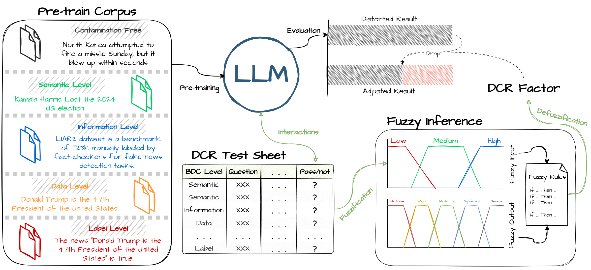

# DCR: Data Contamination Risk Framework

A lightweight, interpretable framework for detecting and quantifying Benchmark Data Contamination (BDC) in Large Language Models (LLMs).

## Overview

The Data Contamination Risk (DCR) framework provides an efficient method to detect and quantify contamination risk during LLM evaluations. It decomposes contamination into four distinct levels and leverages a fuzzy inference system to compute a comprehensive DCR Factor.

### Key Features

- **Four-level contamination detection**: Semantic (L1), Information (L2), Data (L3), and Label (L4)
- **Fuzzy inference system** for interpretable risk quantification
- **Lightweight and efficient** - suitable for real-world applications with limited resources
- **Contamination-aware metrics** - adjusts performance scores based on detected contamination

<p align="center"></p>

## Installation

```bash
# Clone the repository
git clone https://github.com/chengxuphd/dcr.git
cd dcr

# Install dependencies
pip install -r requirements.txt
```

## Project Structure

```
dcr/
├── src/
│   ├── core/
│   │   ├── fuzzy_system.py      # Fuzzy inference system implementation
│   │   └── dcr_calculator.py    # Main DCR calculation logic
│   └── utils/
│       ├── data_loader.py       # Data loading utilities
│       └── output_formatter.py  # Result formatting utilities
├── data/
│   ├── sst2_experimental_data.csv   # SST-2 benchmark data
│   ├── liar2_experimental_data.csv  # LIAR2 benchmark data
│   └── gsm8k_experimental_data.csv  # GSM8K benchmark data
├── config/
│   └── settings.py              # Configuration settings
├── output/
│   ├── sst2_results.csv     # SST-2 benchmark results
│   ├── liar2_results.csv    # LIAR2 benchmark results
│   └── gsm8k_results.csv    # GSM8K benchmark results
├── main.py                      # Main entry point
└── requirements.txt
```

## Usage

### Basic Usage

```bash
# Analyze a specific benchmark
python main.py --benchmark sst2

# Analyze all benchmarks
python main.py --all

# Save results to CSV
python main.py --benchmark liar2 --save-csv
```

### Python API

```python
from src.core import DCRCalculator
from src.utils import DataLoader

# Initialize calculator
calculator = DCRCalculator()

# Load experimental data
data = DataLoader.load_csv('data/sst2_experimental_data.csv')

# Process and analyze
results = calculator.process_experiment_data(data)

# Access results
for result in results['results']:
    print(f"Model: {result['model']}, DCR: {result['dcr']:.4f}")
```

## Contamination Levels

1. **Semantic Level (L1)**: Model exposed to semantically equivalent content
2. **Information Level (L2)**: Model exposed to benchmark metadata or statistics
3. **Data Level (L3)**: Model exposed to actual test data (without labels)
4. **Label Level (L4)**: Model exposed to test data with labels

## Experimental Results

The framework has been validated on 9 LLMs (0.5B-72B parameters) across three benchmarks:

- **SST-2**: Sentiment Analysis
- **LIAR2**: Fake News Detection  
- **GSM8K**: Arithmetic Reasoning

Average error across the three benchmarks: < 4%

## Citation

If you find our work useful in your research, please consider citing:

```bibtex
@misc{xu2025dcr,
      title={DCR: Quantifying Data Contamination in LLMs Evaluation}, 
      author={Cheng Xu and Nan Yan and Shuhao Guan and Changhong Jin and Yuke Mei and Yibing Guo and M-Tahar Kechadi},
      year={2025},
      eprint={2507.11405},
      archivePrefix={arXiv},
      primaryClass={cs.CL},
      url={https://arxiv.org/abs/2507.11405}, 
}
```